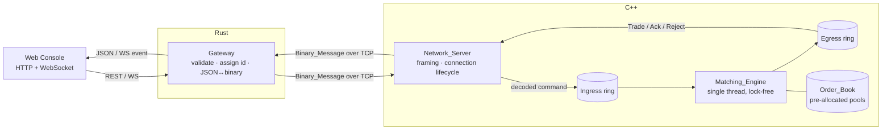

# Hyper-Match-Engine

A low-latency limit-order-matching system built as three cleanly separated tiers: a memory-safe **Rust gateway** that owns the untrusted client boundary, a fixed-layout **binary wire protocol** shared byte-for-byte between languages, and a single-threaded, allocation-free **C++ matching engine** that maintains a price-time-priority limit order book.

The engine is deterministic and does zero dynamic allocation on the hot path. The whole stack runs end-to-end over TCP and ships with a real-time web console for driving and observing it.

---

## Highlights

- **Deterministic core** — identical input sequences produce byte-identical output sequences, independent of wall-clock time or host load.
- **Zero hot-path allocation** — all ring-buffer and order-book memory is reserved at startup; an externally observable allocation counter stays at zero in steady state.
- **Price-time priority matching** — best price first, then earliest arrival, then lowest order id, with an atomic integrity guard that rolls back any operation that would violate a book invariant.
- **Cross-language wire protocol** — a fixed-width, little-endian binary codec implemented independently in Rust and C++ and pinned byte-for-byte by a cross-implementation test.
- **Property-based testing** — 25 correctness properties exercised with `proptest` (Rust) and RapidCheck (C++), alongside unit and integration suites.
- **Real, runnable system** — a TCP engine server, an HTTP/WebSocket gateway, and a dependency-free web dashboard. No mocks.

---

## Architecture



- **Gateway (Rust).** The trust boundary. Parses and validates JSON, assigns or verifies order ids, detects duplicates, encodes to the wire protocol, decodes engine responses, maps outcomes to HTTP status codes, and enforces the engine-response timeout. All untrusted parsing lives here so the engine only ever sees well-formed, in-range messages.
- **Matching engine (C++).** A pure function of `(book state, next message) → (new book state, emitted events)`. No I/O, no clocks, no allocation. Prices are carried as integer ticks (`price × 100`) to keep matching free of floating-point non-determinism.
- **Network server (C++).** A `select`-based TCP event loop behind a portable readiness abstraction; reassembles complete frames per connection, enforces the connection cap, and funnels every close through one teardown path.

See [`docs/DESIGN.md`](docs/DESIGN.md) for the full design and [`docs/REQUIREMENTS.md`](docs/REQUIREMENTS.md) for the requirements.

---

## Repository layout

```
codec/            Rust binary codec (shared wire protocol)
gateway/          Rust gateway library (validation, id assignment, response mapping)
gateway-server/   Rust HTTP/WebSocket server bridging clients to the engine over TCP
cpp/
  codec/          C++ binary codec (mirrors the Rust codec byte-for-byte)
  engine/         Matching engine, order book, ring buffer, integrity guard
  network/        Framing, connection lifecycle, and the real TCP server
  server/         ServerPipeline assembly + hme_engine_server entrypoint
  bench/          Latency/throughput benchmark harness
  tests/          Catch2 + RapidCheck unit and property tests
web/              Dependency-free real-time dashboard (HTML/CSS/JS)
docs/             Design and requirements
```

---

## Wire protocol

Every message is `[type:u8][fixed-width little-endian fields…]` with a fixed total length per type, so framing needs only the leading type byte.

| Message     | Direction        | Bytes | Fields |
|-------------|------------------|-------|--------|
| NewOrder    | client → engine  | 30    | order_id, side, price_ticks, quantity, seq |
| CancelOrder | client → engine  | 9     | order_id |
| Trade       | engine → client  | 37    | exec_seq, price_ticks, quantity, incoming_id, resting_id |
| Ack         | engine → client  | 10    | order_id, kind (accepted / cancelled) |
| Reject      | engine → client  | 10    | order_id, reason |

`price_ticks = round(price × 100)`. An accepted order emits its fills (zero or more `Trade`s) followed by a terminating `Ack(accepted)`; a cancel yields `Ack(cancelled)` or a `Reject`.

---

## Build and run

### Prerequisites

- A C++20 compiler and **CMake ≥ 3.16** (GCC/Clang/MSVC). Ninja recommended.
- **Rust** stable (1.96+) with Cargo.

The C++ test suite fetches Catch2 and RapidCheck via CMake `FetchContent` on first configure.

### 1. Build and run the matching engine (C++)

```bash
cmake -S cpp -B cpp/build -G Ninja
cmake --build cpp/build
# Windows:
./cpp/build/server/hme_engine_server.exe --port 9001
# Linux/macOS:
./cpp/build/server/hme_engine_server --port 9001
```

### 2. Build and run the gateway (Rust)

```bash
cargo build --release
cargo run --release -p gateway-server -- \
    --listen 127.0.0.1:8080 --engine 127.0.0.1:9001 --web ./web
```

### 3. Open the console

Visit **http://localhost:8080**. Submit orders, cancel by id, or use the load generator to drive real traffic through the engine and watch the book, trade tape, latency, and throughput update live.

---

## HTTP / WebSocket API

| Method | Path | Description |
|--------|------|-------------|
| `POST` | `/api/orders` | Submit an order `{side, price, quantity, order_id?}` |
| `POST` | `/api/cancel/{id}` | Cancel a resting order |
| `GET`  | `/api/book?depth=N` | Aggregated order-book snapshot |
| `GET`  | `/api/trades?limit=N` | Recent trades, newest first |
| `GET`  | `/api/stats` | Counters, latency percentiles, throughput, engine status |
| `GET`  | `/ws` | WebSocket stream of `trade` / `accepted` / `rejected` / `cancelled` / `book` / `stats` events |

```bash
curl -s localhost:8080/api/orders -H 'content-type: application/json' \
     -d '{"side":"sell","price":100.00,"quantity":10}'
curl -s localhost:8080/api/orders -H 'content-type: application/json' \
     -d '{"side":"buy","price":100.25,"quantity":12}'
curl -s 'localhost:8080/api/book?depth=10'
```

Validation maps to HTTP status: `400` for malformed/out-of-range input (naming the offending field), `409` for a duplicate order id, `503` when the engine is unreachable within the response ceiling.

---

## Testing

```bash
ctest --test-dir cpp/build      # C++: 178 unit + property tests (Catch2 / RapidCheck)
cargo test --workspace          # Rust: codec + gateway unit, property, and integration tests
```

Property-based testing is the primary technique for the pure, input-varying components (codec, matching, book integrity, framing, determinism, accounting). Each of the 25 design correctness properties is covered by a single property test running at least 100 generated cases.

---

## Design guarantees

- **Determinism.** Two runs over the same input sequence from the same initial book produce identical event streams (verified by a property test running two independent engines and comparing output).
- **Zero hot-path allocation.** A global allocation counter brackets the ingress→process→egress path and is asserted to show a zero delta (the order book and ring buffers are fixed-capacity, inline storage).
- **Bounded everything.** Connection count, message size, ring capacity, and book capacity are all fixed and enforced; back-pressure is signalled rather than allocated around.
- **Integrity.** Price ordering, positive-quantity, and quantity-conservation invariants are checked after every operation; a violation rolls the book back to its pre-operation state and emits an error.

The sustained-throughput target (≥100k orders/sec on a single core) and OS socket timings are validated on representative hardware rather than in CI; the benchmark harness (`cpp/bench`) and its statistics are built and unit-tested here.

---

## License

[MIT](LICENSE)
