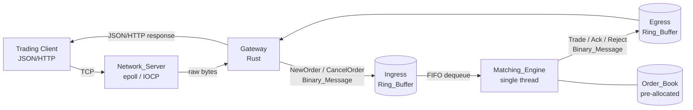
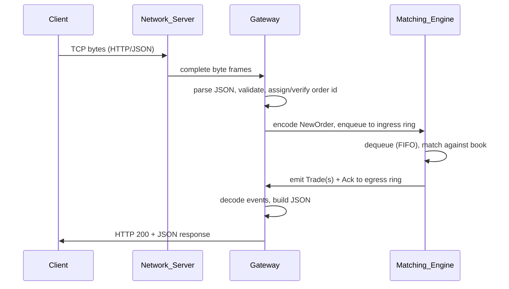
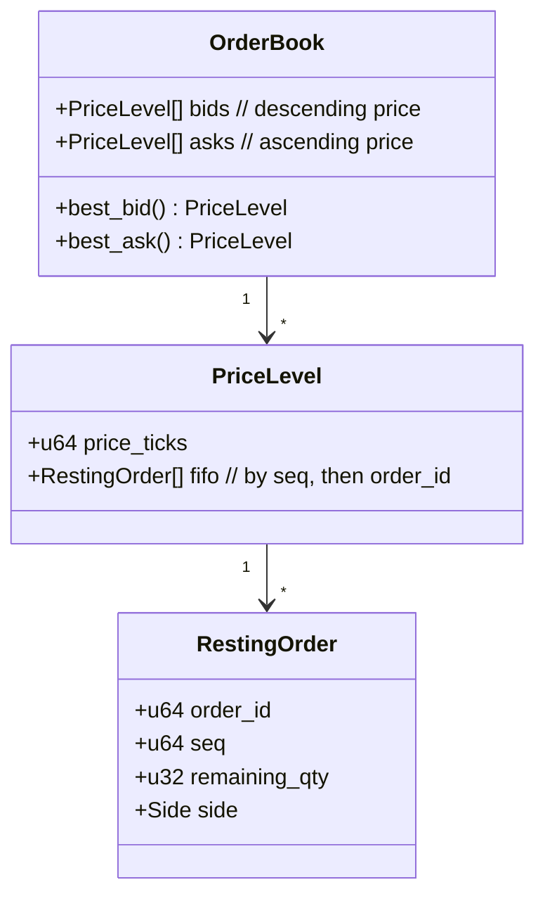

# Design Document

## Overview

Hyper-Match-Engine is a three-tier, low-latency order-matching system. A **Gateway** translates client JSON/HTTP to a fixed-layout binary **Wire_Protocol**, a raw **Network_Server** moves bytes between clients and the engine using OS-native readiness notification, and a single-threaded, lock-free **Matching_Engine** maintains a Limit Order Book and matches orders with strict price-time priority.

The design is driven by three hard constraints that appear directly as measurable requirements:

1. **Determinism** — identical input sequences from identical book state produce byte-identical output sequences (Requirement 6).
2. **Zero hot-path allocation** — all working memory is reserved at startup; the steady-state allocation count is exactly 0 (Requirement 7).
3. **Throughput** — sustained ≥100,000 orders/sec on a single core over a 60-second window (Requirement 9).

These constraints shape every layer of the design: pre-allocated arrays and ring buffers instead of heap containers, integer-only arithmetic in the hot path, and a clean separation between the I/O layers (Gateway, Network_Server) and the deterministic compute core (Matching_Engine).

### Design Principles

- **Separate I/O from compute.** The Matching_Engine never performs network or heap operations. It consumes decoded messages from a ring buffer and emits events to an egress ring buffer. This keeps the hot path deterministic and allocation-free.
- **Integer-domain arithmetic.** Prices are carried as fixed-point integers (scaled by 100, "price ticks") to avoid floating-point non-determinism and rounding drift in the matching core. The Gateway is the only component that touches floating-point JSON values.
- **Fail closed on integrity violations.** Any operation that would break a book invariant is rejected and the book is restored, rather than silently producing an inconsistent state.
- **Bounded everything.** Connection counts, message sizes, ring-buffer capacities, and book capacity are all fixed and enforced.

### Technology Choices

| Component | Language | Rationale |
|-----------|----------|-----------|
| Matching_Engine | C++ (C++20) | Manual memory control, no GC, predictable latency, ring buffers over pre-allocated arrays. |
| Network_Server | C/C++ | Direct access to `epoll` (Linux) / IOCP (Windows); no framework overhead. |
| Gateway | Rust | Memory safety for the untrusted JSON-parsing boundary; strong serde ecosystem; predictable performance. |
| Binary_Codec | Shared spec, implemented in both Rust (Gateway) and C++ (Engine) | Both sides must agree byte-for-byte on the Wire_Protocol. |

## Architecture



### Request Lifecycle (happy path)



### Layer Boundaries

- **Network_Server ↔ Gateway**: The Network_Server is responsible for framing — it accumulates partial reads in a per-connection buffer (≤65,536 bytes) and delivers only complete Binary_Messages. The Gateway never sees partial frames.
- **Gateway ↔ Matching_Engine**: A pair of single-producer/single-consumer ring buffers. The Gateway encodes/decodes; the Engine only sees decoded in-memory message structs read from the ingress ring.
- **Matching_Engine internal**: Pure function of (current book state, next message) → (new book state, emitted events). No clocks, no I/O, no allocation.

## Components and Interfaces

### Gateway

Responsibilities: JSON parsing and validation, order-id assignment and duplicate detection, encoding to Wire_Protocol, decoding engine responses, HTTP status mapping, and request/response timeout enforcement.

```rust
// Validated, normalized order ready for encoding.
struct ValidatedOrder {
    order_id: u64,
    side: Side,           // Buy | Sell
    price_ticks: u64,     // price * 100, range [1, 99_999_999_999]
    quantity: u32,        // range [1, 1_000_000_000]
}

enum GatewayError {
    InvalidJson(String),          // -> HTTP 400
    MissingField(String),         // -> HTTP 400 (names field)
    InvalidField(String),         // -> HTTP 400 (names field)
    DuplicateOrderId(u64),        // -> HTTP 409
    EngineUnavailable,            // -> HTTP 503
}

trait Gateway {
    // Req 1.1-1.7: parse + validate + assign/preserve id + dup check.
    fn handle_new_order(&mut self, body: &[u8]) -> Result<ValidatedOrder, GatewayError>;
    // Req 1.8/1.9: await engine response with 1000ms ceiling, convert within 10ms.
    fn await_response(&mut self, order_id: u64) -> Result<JsonResponse, GatewayError>;
}
```

The Gateway maintains a set of in-use order identifiers to satisfy duplicate detection (Req 1.4) and an id allocator for orders submitted without an id (Req 1.2/1.3).

### Binary_Codec

A shared, fixed-layout codec. Implemented independently in Rust and C++ but governed by one specification so both sides agree byte-for-byte.

```rust
enum BinaryMessage {
    NewOrder   { order_id: u64, side: Side, price_ticks: u64, quantity: u32, seq: u64 },
    CancelOrder{ order_id: u64 },
    Trade      { exec_seq: u64, price_ticks: u64, quantity: u32, incoming_id: u64, resting_id: u64 },
    Ack        { order_id: u64, kind: AckKind },   // Accepted | Cancelled
    Reject     { order_id: u64, reason: RejectReason },
}

enum CodecError {
    UnknownType(u8),       // Req 2.3
    InsufficientLength,    // Req 2.4 (state preserved)
    ExcessTrailingBytes,   // Req 2.5
    FieldOutOfRange(&'static str), // Req 2.6
}

trait BinaryCodec {
    fn encode(&self, msg: &BinaryMessage, out: &mut [u8]) -> Result<usize, CodecError>;
    fn decode(&self, bytes: &[u8]) -> Result<BinaryMessage, CodecError>;
}
```

Each message type has a fixed total byte length (Req 2.1). The first byte is a message-type discriminator; remaining fields are little-endian fixed-width integers and enum bytes. Decoding validates the type byte, the exact length, and field ranges.

### Matching_Engine

The deterministic core. A single thread runs a loop: dequeue a message from the ingress ring, dispatch (new order / cancel), mutate the book, emit events to the egress ring.

```cpp
class MatchingEngine {
public:
    // Req 7.1/7.5: reserve all memory; returns false (abort) if reservation fails.
    bool initialize(const EngineConfig& cfg);

    // Hot path. Pure transition: no allocation, no I/O, no clock reads.
    void process_next();  // dequeues one ingress message, emits events

    // Req 7.3: observable allocation counter (remains 0 in steady state).
    uint64_t hot_path_alloc_count() const;

    // Req 4: integrity invariants are checked after each processed message.
    bool check_invariants() const;
};
```

Dispatch logic:

- **NewOrder**: validate (Req 3.9), then match against the opposite side in price-time priority (Req 3.1-3.6), emit Trade events (Req 3.10), remove fully-filled resting orders (Req 3.7/4.3), and rest any remainder (Req 3.8).
- **CancelOrder**: locate the resting order; remove and Ack (Req 5.1/5.2), or Reject if not found / no longer resting (Req 5.4/5.5).

### Network_Server

Manages up to 10,000 concurrent connections via OS-native readiness notification. Per-connection state holds a framing buffer.

```cpp
class NetworkServer {
public:
    void run();  // event loop: accept, read, frame, deliver, cleanup
private:
    static constexpr size_t   kMaxMessageSize  = 65536;   // Req 8.4/8.5
    static constexpr uint32_t kMaxConnections  = 10000;   // Req 8.2
    struct Connection { int fd; uint8_t buf[kMaxMessageSize]; size_t len; };
};
```

Behavior: accept and register (Req 8.1); reject beyond the cap and release resources (Req 8.2); read and deliver complete frames (Req 8.3); buffer partial frames up to the cap (Req 8.4); close on oversize frame, peer close, or socket error (Req 8.5/8.6/8.7).

### Benchmark Harness

Submits a configurable order volume, records per-order Processing_Latency and aggregate Sustained_Throughput, and reports median/p99 latency, totals, and pass/fail against the 100k orders/sec target (Requirement 9).

## Data Models

### Price and Quantity Domains

- **price_ticks**: `u64`, fixed-point = price × 100. JSON range 0.01–999,999,999.99 maps to ticks 1–99,999,999,999.
- **quantity (Gateway)**: `u32`, range 1–1,000,000,000 (Req 1, Req 7 validation domain at the Gateway).
- **quantity (Engine matching)**: integer, range 1–1,000,000 enforced at the engine boundary (Req 3.9). Orders outside this range are rejected with the book preserved.
- **order_id**: `u64`, unique per live order.
- **seq**: `u64` monotonic arrival sequence number assigned on ingress, used for time priority.
- **exec_seq**: `u64` monotonic trade execution sequence number.

### Order Book Structure



The book is backed entirely by pre-allocated arrays/pools sized at startup (Req 7.1). Resting orders live in a fixed-capacity pool indexed by a free list; price levels and their FIFO queues use pre-allocated storage. No container growth occurs in the hot path.

Ordering within a price level follows Req 3.3: earliest `seq` first; ties broken by lower `order_id`.

### Ring Buffer

```cpp
template <typename T, size_t Capacity>  // Capacity fixed at compile/startup time
struct RingBuffer {
    T slots[Capacity];   // pre-allocated
    size_t head, tail;
    bool try_push(const T&);  // false when full -> back-pressure (Req 7.4)
    bool try_pop(T&);         // FIFO dequeue (Req 6.2)
};
```

### Wire_Protocol Message Layout

Each message: `[type:u8][fixed-width fields...]`, little-endian, fixed total length per type. Example NewOrder layout: `type(1) + order_id(8) + side(1) + price_ticks(8) + quantity(4) + seq(8) = 30 bytes`. All instances of a type share identical layout and length (Req 2.1).

## Correctness Properties

*A property is a characteristic or behavior that should hold true across all valid executions of a system — essentially, a formal statement about what the system should do. Properties serve as the bridge between human-readable specifications and machine-verifiable correctness guarantees.*

The properties below are derived from the acceptance-criteria prework. Redundant criteria were consolidated: book-integrity invariants fold zero-quantity removal into a single positive-quantity invariant; codec malformed-input cases are grouped into one rejection family; determinism subsumes the timing-independence criterion; network reassembly subsumes partial-frame buffering. Criteria classified as INTEGRATION, SMOKE, or single-scenario EXAMPLE (timing bounds, OS socket lifecycle, throughput target, startup reservation, threading topology) are validated by the Testing Strategy below rather than as properties.

### Property 1: Valid order normalization

*For any* JSON order with a valid side, an in-range price, and an in-range integer quantity — whether or not it supplies an order identifier — the Gateway produces a single NewOrder Binary_Message whose side, price (as ticks), and quantity equal the submitted values; when no identifier is supplied the assigned identifier is unique among live orders, and when an identifier is supplied it is preserved unchanged.

**Validates: Requirements 1.1, 1.2, 1.3**

### Property 2: Duplicate identifier rejection

*For any* order identifier already in use, submitting a new order with that identifier causes the Gateway to respond with HTTP 409 (duplicate) and to forward no Binary_Message to the Matching_Engine.

**Validates: Requirements 1.4**

### Property 3: Malformed and invalid request rejection

*For any* request body that is not valid JSON, or any order JSON missing a required field, or any order with a side other than buy/sell, a price outside 0.01–999,999,999.99, or a quantity that is not an integer in 1–1,000,000,000, the Gateway responds with HTTP 400 (identifying the offending field where applicable) and forwards no Binary_Message.

**Validates: Requirements 1.5, 1.6, 1.7**

### Property 4: Codec encode/decode round trip

*For any* valid Binary_Message, encoding it and then decoding the resulting byte sequence yields a Binary_Message equal to the original, with no loss of any field value.

**Validates: Requirements 2.2, 2.7**

### Property 5: Codec decode/encode byte round trip

*For any* byte sequence the Binary_Codec decodes successfully, decoding it and then re-encoding the resulting Binary_Message yields a byte sequence equal to the original bytes.

**Validates: Requirements 2.8**

### Property 6: Fixed layout per message type

*For any* two Binary_Messages of the same type, their encoded byte sequences have identical total length and identical field layout.

**Validates: Requirements 2.1**

### Property 7: Codec rejects malformed input

*For any* byte sequence that declares an unknown message type, is shorter than its declared type requires, or carries excess trailing bytes, decoding returns the corresponding error and no Binary_Message (and on insufficient length the codec state is preserved); and *for any* Binary_Message containing a field outside its protocol-permitted range, encoding returns an out-of-range error and no byte sequence.

**Validates: Requirements 2.3, 2.4, 2.5, 2.6**

### Property 8: Price-time priority matching

*For any* Order_Book and incoming Order, the sequence of resting orders consumed by matching is exactly the eligible opposite-side orders ordered first by best price (lowest ask for a buy, highest bid for a sell) and, within a price level, by earliest arrival sequence number and then lowest order identifier; every trade price is on the correct side of the incoming limit price.

**Validates: Requirements 3.1, 3.2, 3.3**

### Property 9: Trade pricing, sizing, and event completeness

*For any* match between an incoming Order and a Resting_Order, the resulting Trade executes at the Resting_Order's limit price, has a quantity equal to the smaller of the two orders' remaining quantities, has a quantity strictly greater than zero, and is emitted as a Trade event populated with the execution sequence number, price, quantity, incoming order identifier, and resting order identifier.

**Validates: Requirements 3.4, 3.5, 3.10, 4.5**

### Property 10: Incoming order terminal condition

*For any* incoming Order, after the Matching_Engine finishes processing it, either the incoming Order's remaining quantity is zero or no eligible opposite-side Resting_Order remains in the Order_Book.

**Validates: Requirements 3.6**

### Property 11: Quantity conservation

*For any* incoming Order accepted for matching, the incoming quantity equals the sum of all Trade quantities generated for that Order plus the quantity inserted into the Order_Book as a Resting_Order.

**Validates: Requirements 3.8, 4.4**

### Property 12: Invalid order rejection preserves the book

*For any* incoming Order whose quantity is not an integer in 1–1,000,000 or whose price is outside 0.01–999,999,999.99, the Matching_Engine emits a rejection event indicating the validation failure and leaves the Order_Book identical to its state before the Order.

**Validates: Requirements 3.9**

### Property 13: Book price-ordering invariant

*For any* sequence of processed messages, after each message, whenever both a Best_Bid and a Best_Ask exist, the Best_Bid limit price is strictly less than the Best_Ask limit price.

**Validates: Requirements 4.1**

### Property 14: Resting-order positive-quantity invariant

*For any* sequence of processed messages, after each message every Resting_Order in the Order_Book has remaining quantity strictly greater than zero (equivalently, any order whose remaining quantity reaches zero has been removed).

**Validates: Requirements 3.7, 4.2, 4.3**

### Property 15: Cancellation removes a resting order

*For any* Order_Book containing a Resting_Order, processing a Cancel_Request for that order removes it from the Order_Book, emits exactly one cancellation acknowledgement containing its identifier, and excludes that identifier from all subsequent matching.

**Validates: Requirements 5.1, 5.2, 5.3**

### Property 16: Cancellation of a non-resting order is rejected without effect

*For any* Cancel_Request referencing an identifier that is not present in the Order_Book — whether never seen, already fully filled, or already cancelled — the Matching_Engine leaves the Order_Book unchanged and emits exactly one cancellation rejection containing the identifier and the appropriate reason (not found, or no longer resting).

**Validates: Requirements 5.4, 5.5**

### Property 17: FIFO processing order

*For any* sequence of messages enqueued on the ingress Ring_Buffer, the Matching_Engine processes them in the exact first-in-first-out order in which they were enqueued, with no reordering or skipping.

**Validates: Requirements 6.2**

### Property 18: Deterministic output sequence

*For any* initial Order_Book state and *any* sequence of input messages, two independent runs from that initial state produce output event sequences that are identical in both content and ordering, independent of wall-clock time, inter-arrival timing, and host load.

**Validates: Requirements 6.3, 6.4**

### Property 19: Continue deterministically after an invalid message

*For any* input sequence that interleaves valid and invalid messages, the Matching_Engine emits exactly one error event per invalid message and processes the remaining valid messages in their original order, producing the same result as if the invalid messages were simply skipped.

**Validates: Requirements 6.5**

### Property 20: Zero hot-path allocation

*For any* sequence of messages processed after the engine has entered its operational state, the exposed dynamic-allocation counter shows a delta of exactly zero from order ingress to order disposition.

**Validates: Requirements 7.2**

### Property 21: Ring-buffer-full back-pressure

*For any* ingress Ring_Buffer that is at full capacity, attempting to enqueue another Order is rejected with a back-pressure indication, leaves all previously buffered Orders unchanged, and performs zero dynamic memory allocation.

**Validates: Requirements 7.4**

### Property 22: Network framing round trip

*For any* sequence of complete Binary_Messages concatenated into a byte stream and split into arbitrary read chunks (including chunks that bisect a message), the Network_Server's framing logic delivers exactly the original sequence of complete Binary_Messages, buffering partial frames up to 65,536 bytes.

**Validates: Requirements 8.3, 8.4**

### Property 23: Oversize-frame rejection

*For any* byte stream in which a single Binary_Message would exceed 65,536 bytes, the Network_Server's framing logic signals the connection for closure rather than delivering a message or growing its buffer past the cap.

**Validates: Requirements 8.5**

### Property 24: Latency statistic invariants

*For any* non-empty set of recorded per-order Processing_Latency samples, the reported median and 99th-percentile satisfy min ≤ median ≤ p99 ≤ max, and both reported values are members of (or correct interpolations over) the sample set.

**Validates: Requirements 9.3**

### Property 25: Benchmark failed-order accounting

*For any* mixed set of order outcomes (successful and failed/rejected), the benchmark reports a failed-order count equal to the number of failures and computes its Processing_Latency statistics over only the successful orders.

**Validates: Requirements 9.6**

## Error Handling

### Gateway

| Condition | Response | Requirement |
|-----------|----------|-------------|
| Body not valid JSON | HTTP 400 + JSON error | 1.5 |
| Missing required field | HTTP 400 + JSON error naming field | 1.6 |
| Invalid side / price / quantity | HTTP 400 + JSON error naming field | 1.7 |
| Duplicate order identifier | HTTP 409 + JSON error | 1.4 |
| No engine response within 1000 ms | HTTP 503 + JSON error | 1.9 |

The Gateway validates and rejects before forwarding, so an invalid request never reaches the engine. Response conversion is bounded at 10 ms (Req 1.8). The Gateway is the trust boundary: all untrusted JSON parsing and range checking happens here so the engine only ever sees well-formed, in-range Binary_Messages.

### Binary_Codec

Decode errors (`UnknownType`, `InsufficientLength`, `ExcessTrailingBytes`) and the encode error (`FieldOutOfRange`) are returned as typed results, never panics. On `InsufficientLength` the codec preserves its prior state (Req 2.4), allowing the caller to wait for more bytes.

### Matching_Engine

- **Validation rejection** (Req 3.9): out-of-range price/quantity → rejection event, book unchanged.
- **Integrity guard** (Req 4.6): every state transition is checked against the book invariants (price ordering, positive quantity, quantity conservation). If a transition would violate an invariant, the engine restores the pre-operation book state and emits an error identifying the violated invariant. This is implemented by validating the computed result before committing it, so a rejected operation is atomic.
- **Back-pressure** (Req 7.4): a full ingress ring rejects the push and returns back-pressure without allocation.
- **Continue-on-error** (Req 6.5): a rejected message never disturbs the deterministic processing of subsequent messages.
- **Startup failure** (Req 7.5): if working memory cannot be reserved, the engine aborts startup, reports insufficient-memory, and never enters the operational state.

### Network_Server

Oversize frame (Req 8.5), peer close (Req 8.6), and socket error (Req 8.7) all funnel into a single connection-teardown path that closes the socket, releases per-connection resources, and deregisters readiness events. The connection cap (Req 8.2) rejects and releases without retaining state.

## Testing Strategy

### Dual approach

The system is validated with **property-based tests** for input-varying logic (codec, matching, book integrity, framing, determinism, accounting) and **example / integration / smoke tests** for timing bounds, OS-level behavior, performance targets, and one-time setup.

### Property-based testing

PBT is the primary technique for the compute core because the codec, matching engine, and framer are pure, input-varying functions with universal properties (round-trips, invariants, conservation, ordering). Libraries:

- **C++ (Matching_Engine, framing logic)**: [RapidCheck](https://github.com/emil-e/rapidcheck).
- **Rust (Gateway, Binary_Codec)**: [proptest](https://github.com/proptest-rs/proptest).

Rules for every property test:

- Use the chosen library; do **not** hand-roll property testing.
- Run a **minimum of 100 iterations** per property.
- Tag each test with a comment referencing its design property in the form:
  `// Feature: hyper-match-engine, Property {number}: {property_text}`
- Implement each Correctness Property with a **single** property-based test.

Generators of note:
- **Binary_Message generator** for codec round trips (P4–P7), spanning every message type and full field ranges including boundaries (price ticks 1 and 99,999,999,999; quantity 1 and limits).
- **Order_Book generator** producing valid books (respecting the price-ordering and positive-quantity invariants) plus a stream of NewOrder/CancelOrder messages, used for matching, integrity, conservation, cancellation, and determinism properties (P8–P19).
- **Byte-stream chunker** that concatenates messages and re-splits at arbitrary offsets, including oversize frames, for framing properties (P22, P23).
- **Latency-sample and outcome generators** for benchmark statistics (P24, P25).

Edge cases driven through generators: empty book, single resting order, many orders at one price level, exact-fill vs partial-fill vs no-match, boundary prices/quantities, truncated and over-long byte sequences, and unknown type bytes.

### Example-based unit tests

- Engine-unavailable / 1000 ms timeout → HTTP 503 (Req 1.9).
- Integrity-guard fault injection: force an operation that would violate an invariant and assert the book is restored and an error emitted (Req 4.6).
- Startup memory-reservation failure → abort + error + non-operational (Req 7.5).
- Benchmark reporting: small-volume run records throughput and per-order latency (Req 9.1), reports totals and elapsed time (Req 9.4), and a below-target measurement yields a non-success result with the achieved throughput (Req 9.5).

### Integration tests (1–3 examples each)

- Gateway response conversion latency < 10 ms on representative responses (Req 1.8).
- Network_Server: accept + register readiness (Req 8.1); reject past 10,000 connections and release (Req 8.2); release within 100 ms on client close (Req 8.6); close on socket error (Req 8.7).
- End-to-end client → Gateway → Engine → Gateway → client round trip.

### Smoke / configuration checks (single execution)

- Single dedicated processing thread; no order work on other threads (Req 6.1).
- All Ring_Buffer and Order_Book memory reserved at startup with no later reservation (Req 7.1).
- Allocation counter is exposed and readable by an external observer (Req 7.3).

### Performance benchmark (target hardware)

- Sustained ≥100,000 orders/sec over a continuous ≥60-second window on a single core (Req 9.2), reporting median and p99 Processing_Latency (Req 9.3), totals and elapsed time (Req 9.4), and a non-success exit if the target is missed (Req 9.5). This benchmark is the authoritative check for the throughput and latency NFRs and runs on representative hardware rather than in CI emulation.
